# Lab 02 — Install Windows 10 on VirtualBox

## Goal
Install Windows 10 in a VirtualBox VM and validate basic networking.

## Environment
- Host OS: Windows (Host PC)
- Hypervisor: Oracle VirtualBox
- Guest OS: Windows 10 (x64)

## What I saved (Evidence)
- Screenshots: `./screenshots/`
- Command outputs: `./outputs/`

---

## Step-by-step

### Part 1 — Download Windows 10 ISO (Microsoft)
1. Search “Windows 10 ISO download” and open Microsoft’s Windows 10 download page.
2. Download the **Media Creation Tool**.
3. Open the Media Creation Tool and accept the license terms.
4. Select **Create installation media (USB flash drive, DVD, or ISO file)**.
5. Confirm language/edition/architecture (64-bit).
6. Choose **ISO file**, select a folder, and save the ISO.
7. Finish the tool once the ISO is created.

### Part 2 — Create the VirtualBox VM
8. Open **Oracle VirtualBox Manager**.
9. Click **New** to create a VM.
10. Name the VM (example: “Windows 10”) and choose the VM folder location.
11. Set CPU and RAM (example: 4 CPUs, ~8–12GB RAM depending on host).
12. Create a virtual disk (example: 50GB, dynamically allocated).
13. Open VM **Settings** to confirm configuration.

### Part 3 — Attach ISO and boot
14. Start the VM.
15. If prompted to select a startup disk/ISO, browse and select the **Windows 10 ISO**.
16. Click **Mount and Retry Boot**.

### Part 4 — Install Windows 10
17. On Windows Setup, confirm language/time/keyboard and click **Next**.
18. Click **Install now**.
19. Select **I don’t have a product key** (lab environment).
20. Choose edition (example: Windows 10 Pro) and click **Next**.
21. Accept license terms and click **Next**.
22. Choose **Custom: Install Windows only (advanced)**.
23. Select the virtual disk (Drive 0 Unallocated Space) and click **Next**.
24. Wait for installation + automatic restarts.

### Part 5 — First-time setup (OOBE)
25. Choose region and keyboard layout.
26. Skip second keyboard layout (if not needed).
27. Choose personal use (or your preferred option).
28. Create a local/offline account (screenshots may be omitted for privacy).
29. Finish privacy settings (keep it simple for a lab).
30. Reach the Windows desktop.

---

## Screenshots

### ISO Download
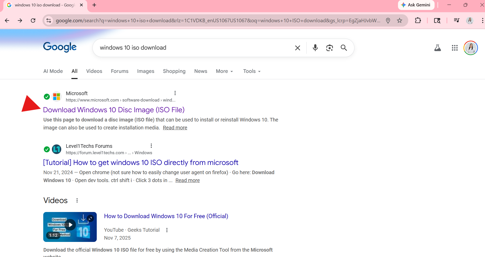
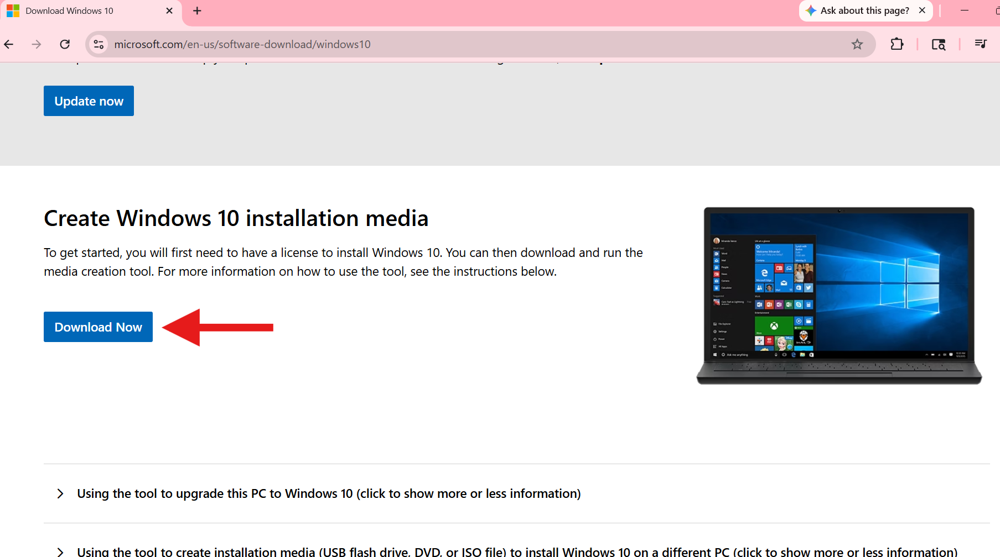
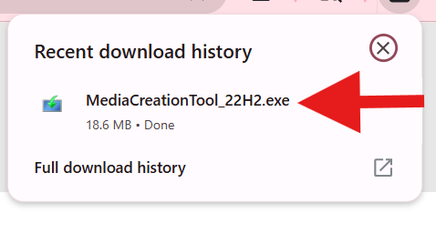

### VirtualBox VM Creation
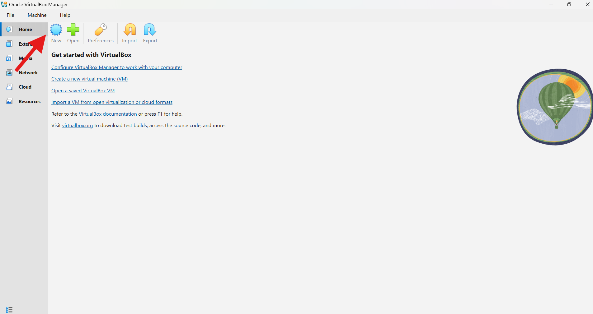
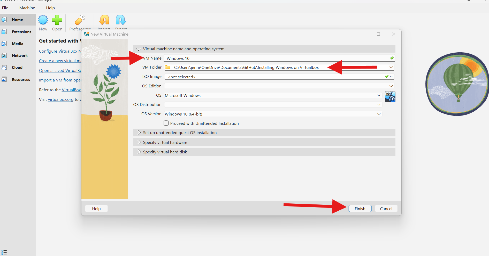
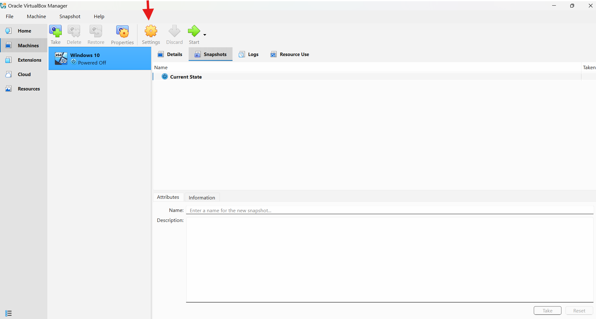

### Boot + Install
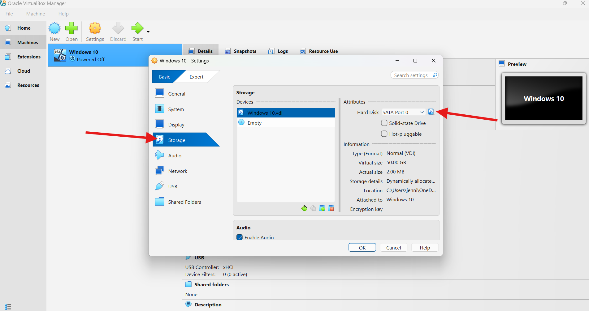
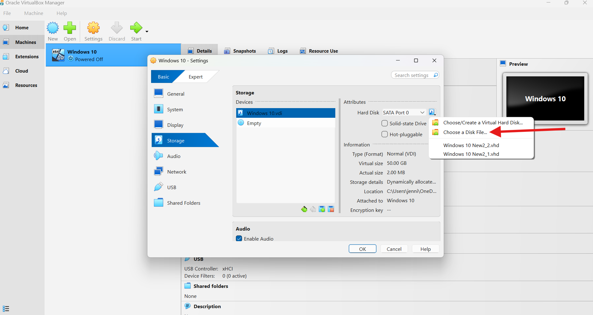
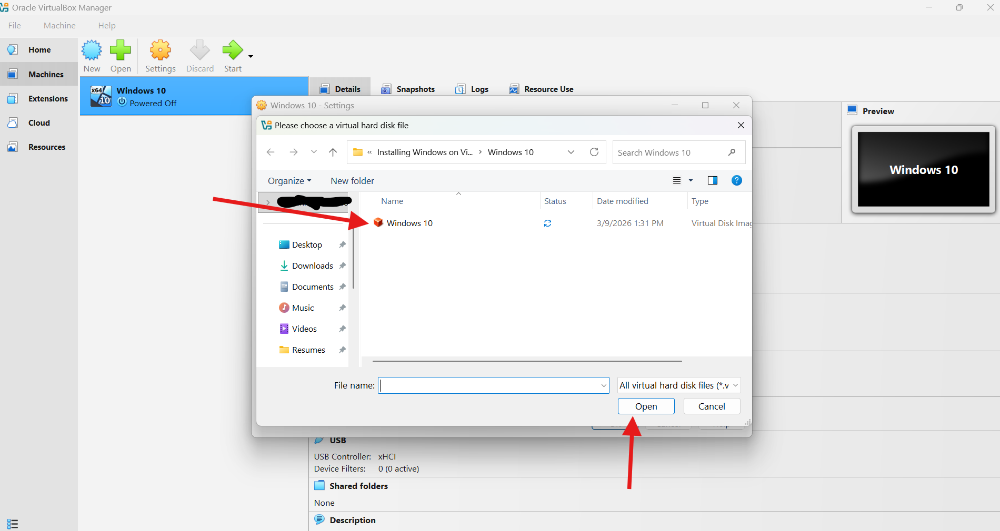

### First Boot / Desktop
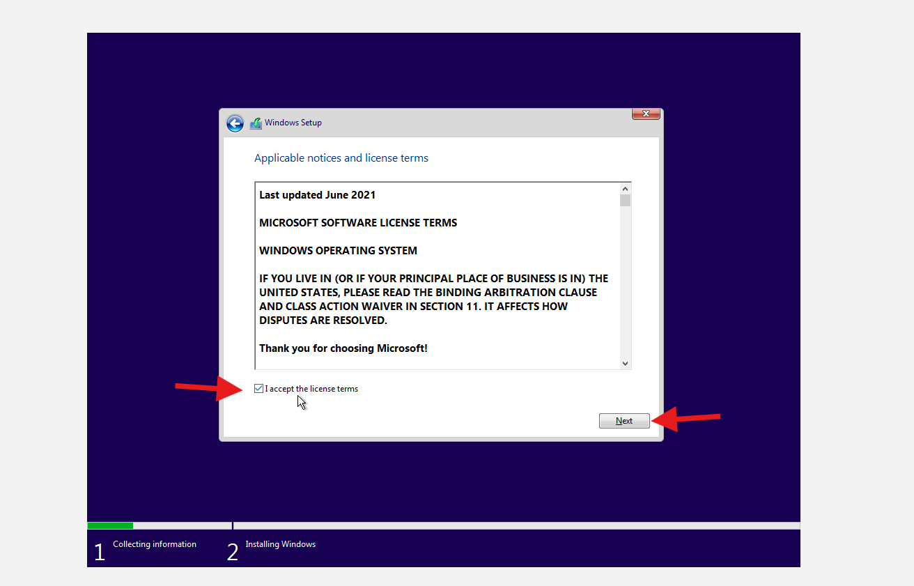
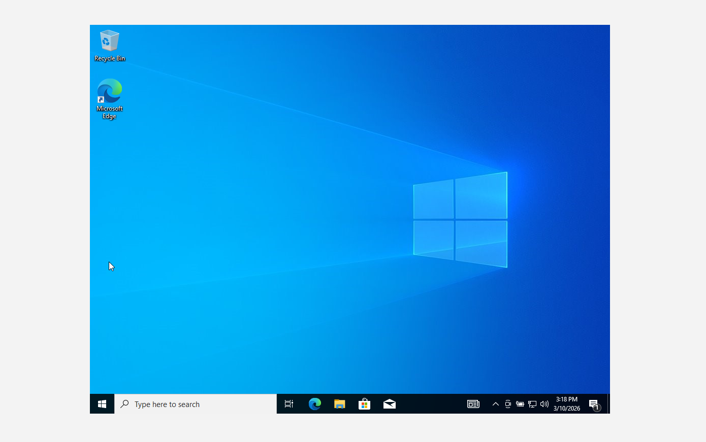

---

## Verification (Outputs)
Outputs saved to: [`./outputs/`](./outputs/)

- [`win10-ipconfig.txt`](./outputs/win10-ipconfig.txt)
- [`win10-ping.txt`](./outputs/win10-ping.txt)
- 
Commands used:
```bat
ipconfig /all > win10-ipconfig.txt
ping 8.8.8.8 > win10-ping.txt
ping google.com >> win10-ping.txt
