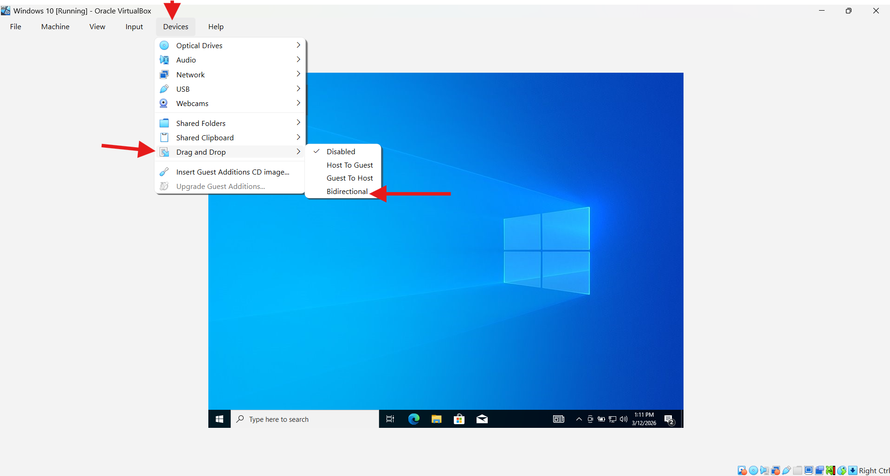
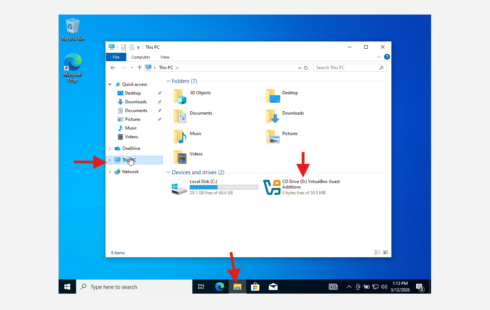
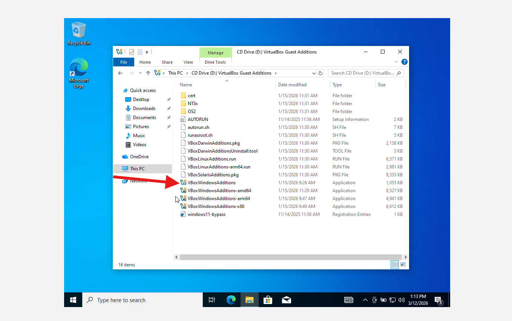
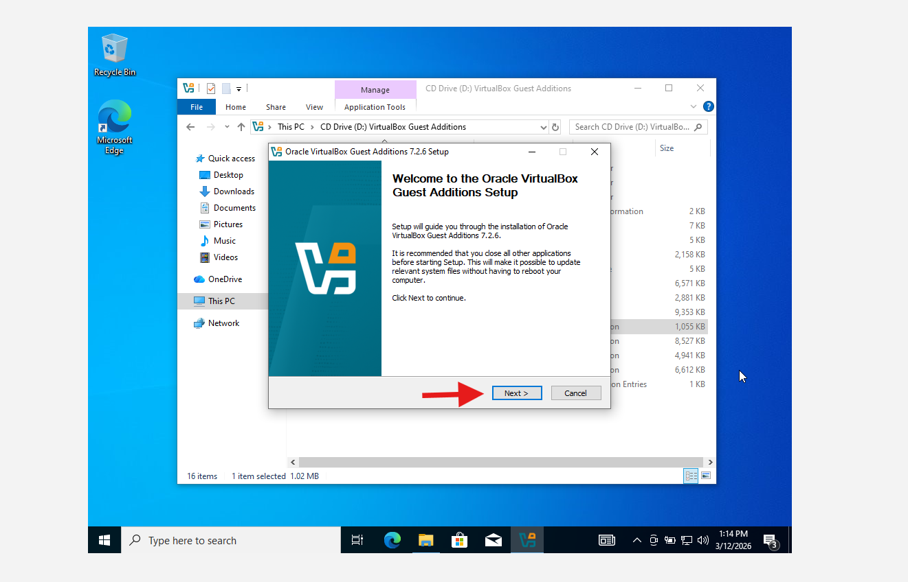
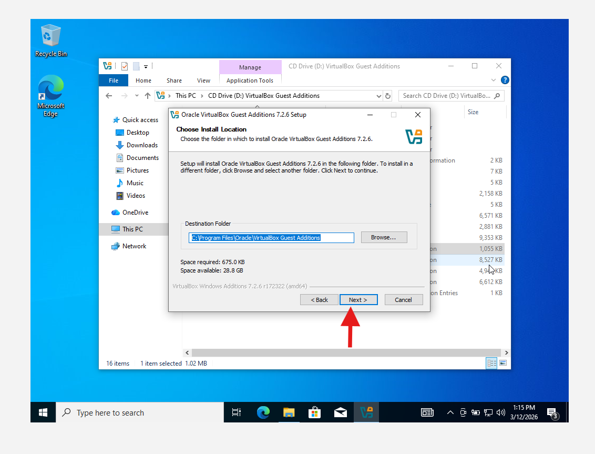
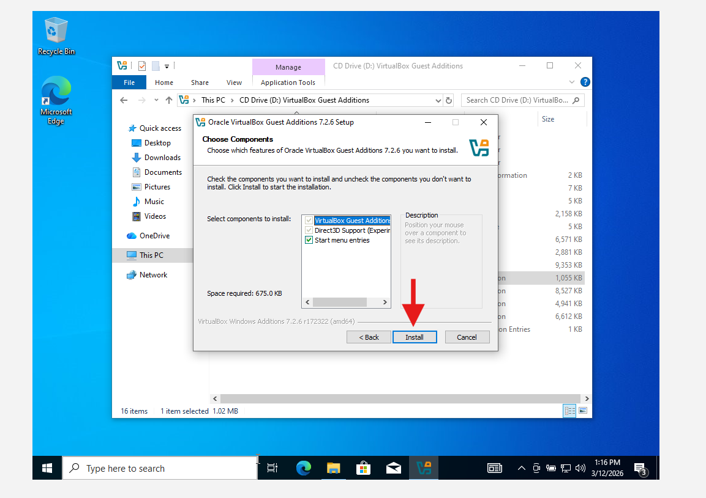
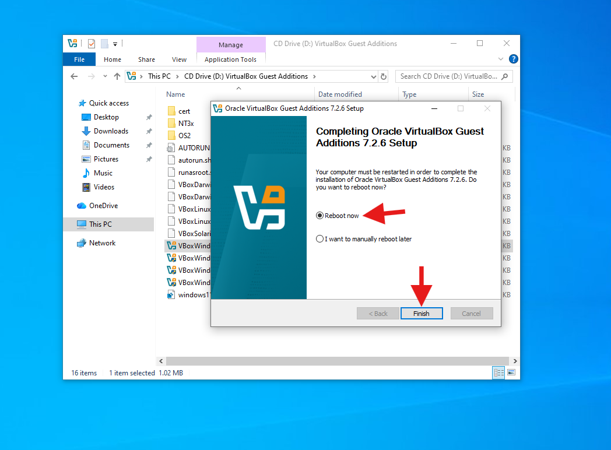

# Lab 03 — Install VirtualBox Guest Additions (Windows 10)

## Goal
Install VirtualBox Guest Additions on the Windows 10 VM so features like:
- Better screen resizing (auto-resize)
- Shared clipboard
- Drag & Drop  
work correctly.

## Environment
- Host OS: Windows (Host PC)
- Hypervisor: Oracle VirtualBox
- Guest OS: Windows 10 (x64)

## Steps (what I did)
1. In the VM window, go to **Devices → Drag and Drop → Bidirectional** (optional but recommended).
2. Go to **Devices → Insert Guest Additions CD Image…**
3. In Windows (inside the VM), open **This PC** and open the **CD Drive: VirtualBox Guest Additions**
4. Run **VBoxWindowsAdditions-amd64.exe**
5. Click **Yes** on the UAC prompt.
6. Setup wizard:
   - **Next**
   - **Next** (install location)
   - **Install**
   - **Reboot now → Finish**

## Evidence (Screenshots)

## Verification
After reboot, confirm at least one of these works:
- Drag a file from host → VM
- Copy/paste text from host → VM
- VM screen resizes automatically when you resize the window
