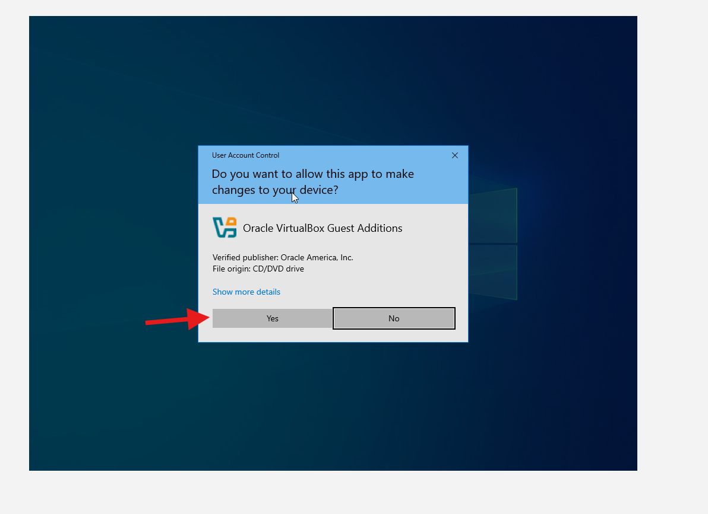

# Lab 03 — Install VirtualBox Guest Additions (Windows 10)

## Goal
Install VirtualBox Guest Additions to enable better display, mouse integration, and copy/paste + drag/drop.

## Environment
- Host OS: Windows (Host PC)
- Hypervisor: Oracle VirtualBox
- Guest OS: Windows 10 (x64)

## What I saved (Evidence)
- Screenshots: `./screenshots/`

---

## Steps

1. In the VM window, go to **Devices → Drag and Drop → Bidirectional**.
2. Open **File Explorer** and confirm the **CD Drive (D:) VirtualBox Guest Additions** is mounted.
3. Open the CD Drive and run **VBoxWindowsAdditions-amd64** (or VBoxWindowsAdditions).
4. If prompted by UAC, click **Yes**.
5. In the setup wizard, click **Next**.
6. Keep the default install location and click **Next**.
7. Keep the components selected and click **Install**.
8. Choose **Reboot now** and click **Finish**.

---

## Screenshots (Evidence)

